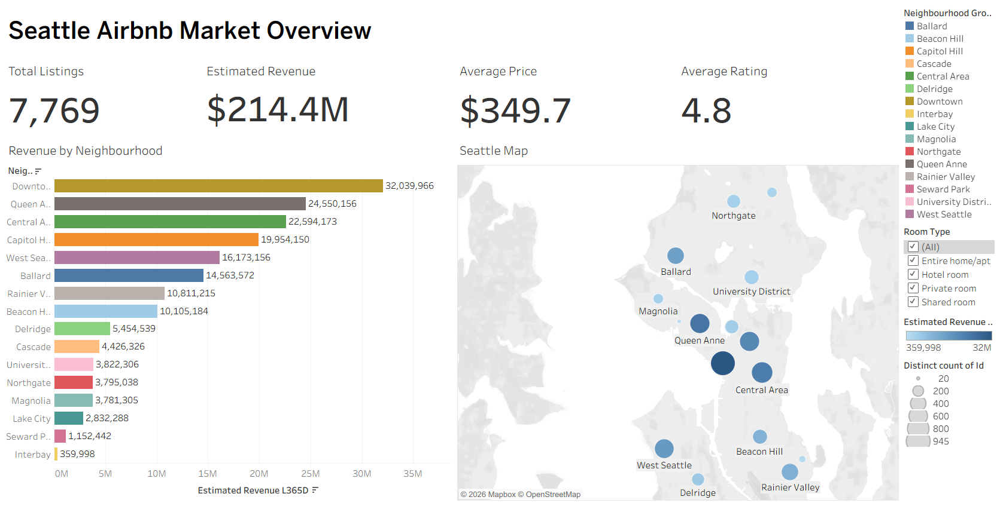
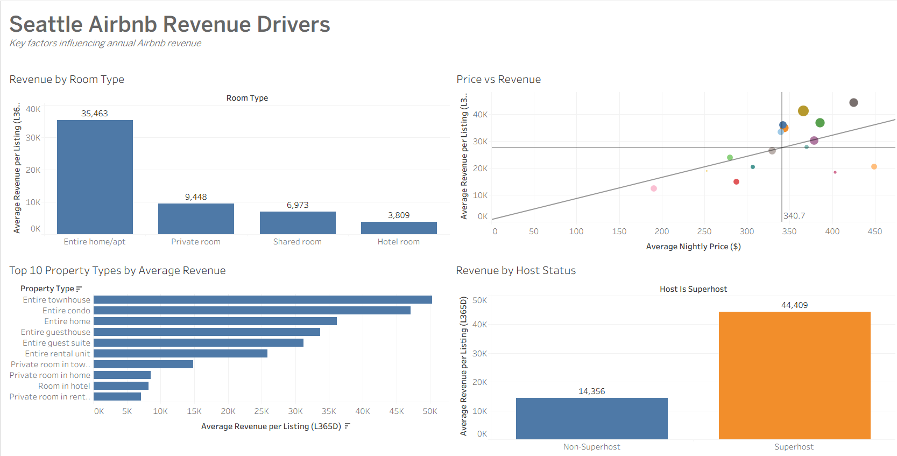
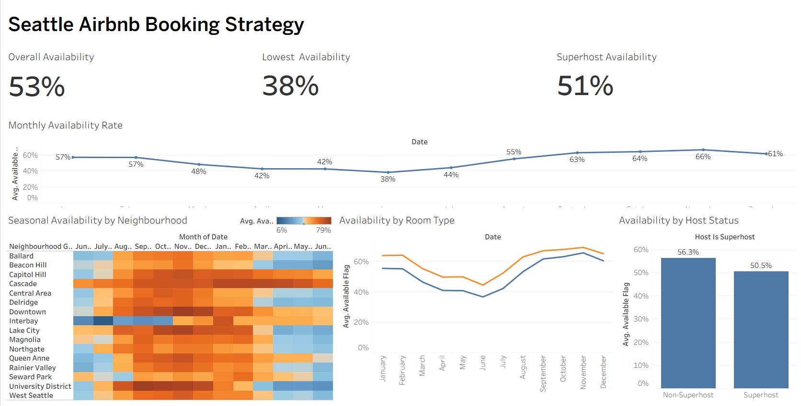

# Seattle Airbnb Market Analysis

An interactive Tableau project analysing the Seattle Airbnb market using the **Inside Airbnb** dataset. This project explores market performance, identifies the key factors influencing annual revenue, and investigates seasonal booking patterns to support data-driven business decisions for Airbnb hosts and property managers.

## Project Overview

The Airbnb market is highly competitive, with pricing, property characteristics, and seasonal demand all influencing listing performance. This project was developed to provide actionable business insights by answering three key questions:

- Which neighbourhoods perform best in terms of Airbnb revenue?
- What listing characteristics are associated with higher annual revenue?
- How do seasonal booking patterns change throughout the year?

To answer these questions, three interactive Tableau dashboards were created, each focusing on a different stage of the analysis.

---

## Business Questions

This project aims to answer the following questions:

### Market Overview
- Which neighbourhoods have the highest concentration of Airbnb listings?
- Which areas generate the highest estimated annual revenue?
- How does pricing vary across Seattle?

### Revenue Drivers
- Which room types generate the highest annual revenue?
- How does nightly price relate to annual revenue?
- Does Superhost status influence revenue performance?
- Which property types perform best?

### Booking Strategy
- During which months is booking demand strongest?
- Which neighbourhoods experience the lowest availability?
- Do Superhosts exhibit different booking patterns from other hosts?

---

## Dataset

**Source**

Inside Airbnb

https://insideairbnb.com/

**Location**

Seattle, Washington, USA

**Tables Used**

- listings.csv
- calendar.csv

### Data Model

A Tableau **Relationship** was used instead of an Inner Join.

```
Listings.id
        │
Relationship
        │
Calendar.listing_id
```

This approach prevents duplicate revenue calculations while allowing availability analysis using the calendar dataset.

---

# Dashboard 1 — Seattle Airbnb Market Overview



### Objective

Provide an overall view of Seattle's Airbnb market.

### Key Visualisations

- Market KPIs
- Revenue by Neighbourhood
- Seattle Neighbourhood Map
- Interactive Filters

### Key Insights

- Several central neighbourhoods generate significantly higher estimated annual revenue.
- Listing distribution varies considerably across Seattle.
- Average nightly prices differ by location, highlighting potential pricing opportunities.

---

# Dashboard 2 — Seattle Airbnb Revenue Drivers



### Objective

Identify the factors most strongly associated with higher annual Airbnb revenue.

### Key Visualisations

- Revenue by Room Type
- Price vs Estimated Revenue
- Revenue by Property Type
- Revenue by Host Status

### Key Insights

- Entire homes generally achieve higher estimated annual revenue than private rooms.
- Property type influences revenue performance.
- Superhost listings tend to outperform non-Superhost listings.
- Increasing price alone does not necessarily lead to higher annual revenue.

---

# Dashboard 3 — Seattle Airbnb Booking Strategy



### Objective

Understand seasonal booking behaviour using Airbnb availability data.

### Key Visualisations

- Monthly Availability Trend
- Seasonal Availability Heatmap
- Availability by Host Status
- Booking KPIs

### Key Insights

- Availability decreases during peak travel months, indicating stronger booking demand.
- Seasonal demand differs across neighbourhoods.
- Superhost listings generally maintain lower availability than non-Superhost listings, suggesting stronger occupancy.

---

# Business Recommendations

Based on the analysis, the following recommendations are proposed:

### Optimise Seasonal Pricing

Adjust nightly prices before periods of high demand to maximise annual revenue.

### Focus on High-performing Locations

Neighbourhoods consistently generating higher revenue should receive greater investment and marketing attention.

### Improve Listing Quality

Maintaining Superhost status may contribute to stronger booking performance and lower availability.

### Develop Neighbourhood-specific Strategies

Seasonal demand varies across Seattle, suggesting pricing and promotional strategies should be tailored to individual neighbourhoods rather than applying a single city-wide approach.

---

# Skills Demonstrated

### Data Analysis

- Exploratory Data Analysis (EDA)
- Business Analysis
- KPI Development
- Trend Analysis

### Data Visualisation

- Interactive Dashboards
- Heatmaps
- Scatter Plots
- Geographic Mapping
- Dashboard Storytelling

### Tableau

- Relationships
- Calculated Fields
- Interactive Filters
- Dashboard Actions
- KPI Design

---

# Repository Structure

```
Seattle-Airbnb-Market-Analysis
│
├── README.md
│
├── Tableau/
│   └── Seattle Airbnb Analysis.twbx
│
├── Images/
│   ├── dashboard1.png
│   ├── dashboard2.png
│   └── dashboard3.png
│
└── Data/
    ├── listings.csv (optional)
    └── calendar.csv (optional)
```

---

# Tableau Public

View the interactive dashboards here:

**Tableau Public**

(Add your Tableau Public link)

---

# Author

**Alan Chan**

Aspiring Data Analyst

Skills:

- Tableau
- SQL
- Excel
- Data Visualisation
- Business Intelligence
